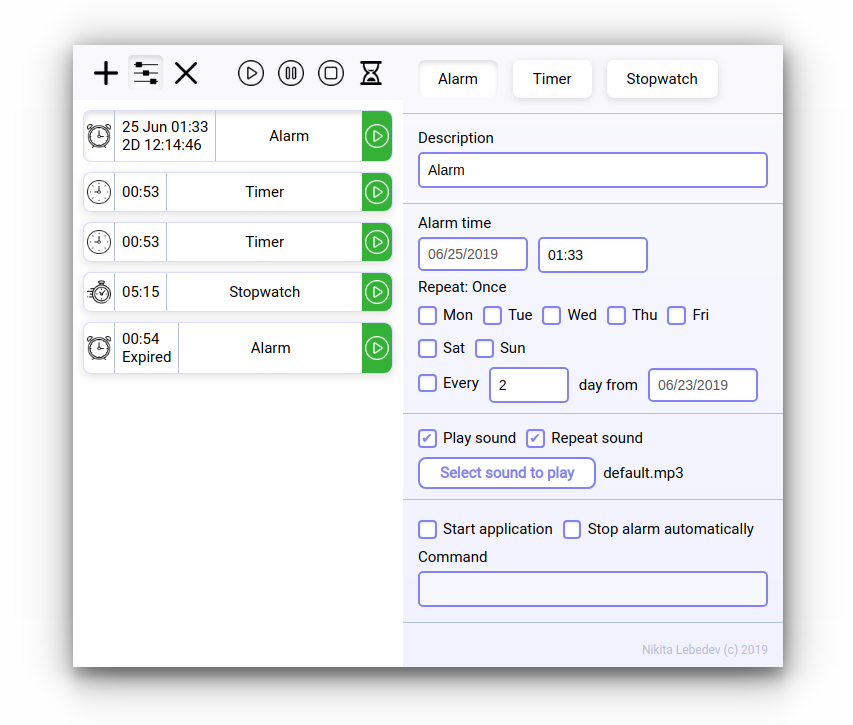

<h1 align="center">Alarm Cron</h1>

<h4 align="center">
  <a href="https://github.com/bl00mber/alarm-cron/releases/latest/download/Alarm-Cron.dmg">macOS</a> ·
  <a href="https://github.com/bl00mber/alarm-cron/releases/latest/download/AlarmCronInstaller.exe
">Windows</a> ·
  <a href="https://github.com/bl00mber/alarm-cron/releases/latest/download/alarm-cron_amd64.deb">Linux</a>
</h4>

  

## System
#### Minimal requirements
Windows 7 KB2533623

#### Command examples
MacOS: `open -a Terminal ~/Desktop`

Windows: `start cmd`

  

## License
 
[Nick Reiley (c)](https://github.com/bl00mber)
