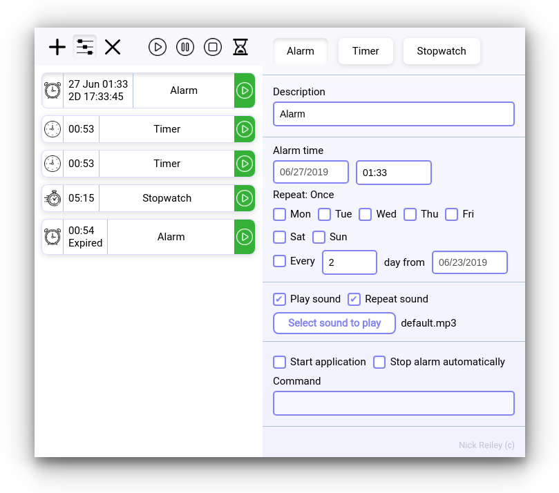

<h1 align="center">Alarm Cron</h1>

<h4 align="center">
  <a href="https://github.com/bl00mber/alarm-cron/releases/latest/download/Alarm-Cron.dmg">macOS</a> ·
  <a href="https://github.com/bl00mber/alarm-cron/releases/latest/download/AlarmCronInstaller.exe
">Windows</a> ·
  <a href="https://github.com/bl00mber/alarm-cron/releases/latest/download/alarm-cron_amd64.deb">Linux</a>
</h4>

  

## System
#### Minimal requirements
Windows 7 KB2533623

#### Command examples
MacOS: `open -a Terminal ~/Desktop`

Windows: `start cmd`

  

## Support

200$ alarm background color picker

200$ sound test play

200$ append path to command field (file path input)

400$ mass alarm select (range, pick) & processing

400$ alarm position drag'n'drop

400$ active alarms on top, fading animation of recently active alarms with duration and color

400$ add specific language

500$ add top 5 languages

500$ keyboard shortcuts (menu, alarm handlers, list, edit, settings navigation)

600$ default alarm: more than one, names, add selected default alarms from tray

600$ custom dates alarm repeat datepicker

600$ chained looped/non-looped timer each with its own settings (example: 20m -> 5m -> 10m)

400$ stopwatch activation (sound/command) after specified time

600$ halt (stopwatch that can't be paused and remains enabled when system is turned off). Can be set from custom date/time, activated after specified time

600$ predefined commands constructor for particular operational system (windows, macos, ubuntu)

800$ predefined commands for windows, macos, ubuntu (image, audio, video, web)

## License

